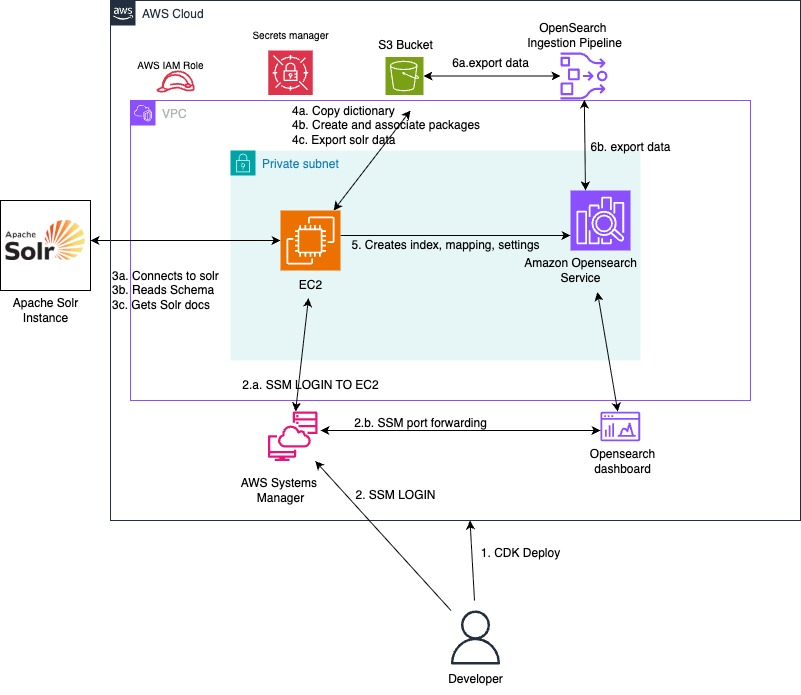

#  Migrate Apache Solr to Amazon OpenSearch Service


## Introduction 

This guide helps you migrate your Apache Solr schema and data to Amazon OpenSearch Service. 
The solution uses AWS Cloud Development Kit (AWS CDK) to deploy the necessary infrastructure and provides 
automated tools for schema translation and data migration.

In this guide, you will:
- Deploy the target environment including Amazon OpenSearch Service, Amazon VPC, and migration tools
- Migrate your Solr schema, including custom field types, analyzers, and field mappings
- Export data from Solr 
- Setup an Amazon OpenSearch Ingestion (OSIS) pipeline to ingest the data into Amazon OpenSearch Service

## Architecture

The following diagram illustrates the migration architecture:



The solution includes the following components:
- **Amazon VPC**: Secure networking for all components
- **Amazon EC2 workbench**: Migration tools and scripts pre-installed
- **Amazon S3**: Storage for exported data and dictionary files
- **Amazon OpenSearch Service**: Target search and analytics engine
- **Amazon OpenSearch Ingestion** (optional): Automated data ingestion pipeline

As part of migration activity the tool does following steps:

**Initialization**: The tool initializes the Apache Solr client and Amazon OpenSearch Service client by performing read operations to verify credentials.

**Migration**: The tool translates custom field types with their associated analyzers, including filters, tokenizers, and character filters. 
It also translates fields, copy fields, and dynamic fields according to the migrated field types. 
For each filter that references a dictionary file, when create_package_configuration is set to true, 
the tool reads the file from Solr, uploads it to Amazon S3, and 
creates Amazon OpenSearch Service packages that associate the file with your OpenSearch domain.

**Output**: The tool generates an `index.json` file with the translated mappings and settings, and produces HTML reports summarizing the migration results. 
Based on your configuration, it can automatically create the index in Amazon OpenSearch Service.


## Prerequisites

- **AWS Command Line Interface (AWS CLI)** version 2.x or later, installed and configured
  - [Installation Guide](https://docs.aws.amazon.com/cli/latest/userguide/getting-started-install.html)
  - [Configuration Guide](https://docs.aws.amazon.com/cli/latest/userguide/cli-chap-configure.html)
- **Session Manager Plugin** for AWS CLI (required for EC2 access)
  - [Installation Guide](https://docs.aws.amazon.com/systems-manager/latest/userguide/session-manager-working-with-install-plugin.html)
- **Node.js** version 20.x or later
  - [Download Node.js](https://nodejs.org/)
- **AWS Cloud Development Kit (AWS CDK)** version 2.x installed globally:
  ```bash
  npm install -g aws-cdk
  ```
  - [CDK Getting Started Guide](https://docs.aws.amazon.com/cdk/v2/guide/getting_started.html)

### Pre-flight Checklist

Before proceeding, verify your environment setup:

```bash
# Verify AWS CLI configuration
aws sts get-caller-identity
aws configure list

# Verify Node.js version (should be 20.x or later)
node --version
npm --version

# Verify CDK installation (should be 2.x.x)
cdk --version

# Verify Session Manager plugin
session-manager-plugin

# Test CDK environment
cdk doctor
```

**Expected outputs:**
- `aws sts get-caller-identity` should return your AWS account details
- `node --version` should show v20.x.x or later
- `cdk --version` should show 2.x.x
- `session-manager-plugin` should show version information

- **AWS account requirements:** AWS Identity and Access Management (IAM) permissions to create and manage:
  * [Amazon Virtual Private Cloud (Amazon VPC)](https://docs.aws.amazon.com/vpc/latest/userguide/) resources (VPCs, subnets, route tables, security groups)
  * [Amazon OpenSearch Service](https://docs.aws.amazon.com/opensearch-service/latest/developerguide/) domains
  * [Amazon Simple Storage Service (Amazon S3)](https://docs.aws.amazon.com/s3/latest/userguide/) buckets
  * [Amazon Elastic Compute Cloud (Amazon EC2)](https://docs.aws.amazon.com/ec2/latest/userguide/) instances
  * [IAM roles and policies](https://docs.aws.amazon.com/IAM/latest/UserGuide/)
  * [AWS CloudFormation](https://docs.aws.amazon.com/cloudformation/latest/userguide/) stacks
  * [Amazon OpenSearch Ingestion](https://docs.aws.amazon.com/opensearch-service/latest/developerguide/ingestion.html) pipelines (if using the data ingestion feature)

- **AWS Profile** configured with necessary IAM permissions for deploying CDK resources
  - [AWS CLI Configuration Guide](https://docs.aws.amazon.com/cli/latest/userguide/cli-configure-files.html)
  
- **Apache Solr source system requirements:**
  - Apache Solr instance version 7.x or later 
  - Network connectivity from your AWS environment to the Solr instance 
  - Solr admin credentials (if authentication is enabled)

## Migration Approaches

You can migrate your Solr data to OpenSearch using one of two approaches:

### Option 1: Automated CDK Deployment (Recommended)
Deploy complete infrastructure (VPC, OpenSearch, S3, EC2) using AWS CDK. Provides automated setup with secure networking and optional ingestion pipeline.

👉 **[CDK Deployment](#set-up-and-deploy-the-migration-environment)**

### Option 2: Local Machine Setup
Run the migration tool on your local machine or existing server. Best for testing, small migrations, or when you already have an OpenSearch domain.

👉 **[Local Setup](#local-machine-setup-alternative)**

---

## Set up and deploy the Migration environment

The CDK stack deploys the following resources:
- Amazon Virtual Private Cloud (Amazon VPC) with public and private subnets
- Amazon OpenSearch Service domain with security configuration
- Amazon S3 bucket for data migration and dictionary files
- Amazon EC2 instance as migration workbench with pre-installed tools
- IAM roles with least-privilege permissions
- Custom resource to configure role mappings
- Amazon OpenSearch Ingestion pipeline (only when ENABLE_PIPELINE=true in .env):
  - Amazon S3 as source
  - Amazon OpenSearch Service as destination

This project uses AWS Cloud Development Kit (AWS CDK) to deploy the migration environment, 
including an Amazon OpenSearch Service domain, Amazon S3 bucket, Amazon VPC, and Amazon EC2 workbench with pre-configured migration tools.


1. Clone the repository and navigate to the project directory:
   ```bash
   git clone https://github.com/aws-samples/sample-apache-solr-to-amazon-opensearch-service-migration.git
   cd sample-apache-solr-to-amazon-opensearch-service-migration
   ```

2. **Configure AWS Profile and Region** (if not already set):
   ```bash
   # Set your AWS profile (if using named profiles)
   export AWS_PROFILE=your-profile-name
   
   # Set your preferred AWS region
   export AWS_DEFAULT_REGION=us-east-1
   
   # Verify configuration
   aws sts get-caller-identity
   aws configure list
   ```

3. Navigate to the CDK directory and create your environment configuration:

  ```bash
  cd cdk
  cp .env.example .env
  ```

**Important: Customize your deployment** by editing the .env file:
  ```bash  
  vi .env 
  ```
  
  **You should update these values before deployment:**

| Parameter       | Environment Variable | Default               | Description                  | **Action Required** |
|-----------------|----------------------|-----------------------|------------------------------|---------------------|
| Name Prefix     | `NAME_PREFIX`        | `solr2os`             | Prefix for all AWS resources | **Change to unique value** (e.g., `myorg-solr2os`) |
| Domain Name     | `DOMAIN_NAME`        | `{namePrefix}-domain` | OpenSearch domain name       | **Optional**: Use prefix pattern or custom name |
| Index Name      | `INDEX_NAME`         | `solr-migration`      | Target OpenSearch index      | **Optional**: Change if needed |
| VPC CIDR        | `VPC_CIDR`           | `10.0.0.0/16`         | New VPC CIDR block           | **Optional**: Change if conflicts with existing VPCs |
| ENABLE_PIPELINE | `ENABLE_PIPELINE`    | `false`               | Deploy an Amazon OpenSearch Ingestion (OSIS) pipeline      | **Set to `true`** if you want automated data ingestion |

**Critical Notes:**
- **NAME_PREFIX must be unique** across your AWS account to avoid S3 bucket naming conflicts
- **Resource names follow the pattern** `{namePrefix}-{resource-type}` (e.g., `myorg-solr2os-domain`, `myorg-solr2os-migration-bucket`)
- **ENABLE_PIPELINE=false by default** - set to `true` only if you want the automated ingestion pipeline

⚠️ **Important:** If deployment fails with a bucket name conflict error, update your NAME_PREFIX to a more unique value (e.g., include your organization name or project identifier)

4. Install dependencies, build the project, and deploy the stack:

```bash
npm install
npm run build
```

**Bootstrap CDK (if not already done):**

If you have not deployed with CDK into your account/region before, you need to bootstrap:

```bash
# Bootstrap with default settings (uses current AWS profile and region)
cdk bootstrap

# Or bootstrap for specific account and region
cdk bootstrap aws://ACCOUNT-NUMBER/REGION

# Example: Bootstrap for account 123456789012 in us-east-1
cdk bootstrap aws://123456789012/us-east-1
```

**Verify bootstrap status:**
```bash
# Quick check - just shows if CDKToolkit exists and its status
aws cloudformation describe-stacks --stack-name CDKToolkit --region YOUR_REGION --query 'Stacks[0].{StackName:StackName,Status:StackStatus}' --output table
```

📖 **Learn more:** [CDK Bootstrapping Guide](https://docs.aws.amazon.com/cdk/v2/guide/bootstrapping.html)

**Note:** You only need to bootstrap once per account/region combination.

**Deploy the stack:**
```bash
cdk deploy
```

**Note:** CDK will show a security review with IAM policy and security group changes. Review the changes and type `y` to confirm deployment.

**If deployment fails, check for common issues:**
```bash
# Check CloudFormation events for detailed error messages
aws cloudformation describe-stack-events --stack-name Solr2OS --query 'StackEvents[?ResourceStatus==`CREATE_FAILED`]'

# If you get "SignatureDoesNotMatch: Signature expired" error during long deployments
# This happens when AWS credentials expire during deployment (typically after 30+ minutes)
# Simply retry the deployment - CDK will resume from where it left off
cdk deploy

# If EC2 instance exists but migration code is missing (incomplete initialization)
# This can happen when deployment fails during EC2 setup
# Option 1 (Recommended): Clean redeploy for reliable setup
cdk destroy
cdk deploy

# Option 2 (Manual workaround): Fix the existing EC2 instance
# Connect to EC2 via SSM Session Manager and run:
# cp sample-apache-solr-to-amazon-opensearch-service-migration/migrate.toml ~/migrate.toml.backup
# sudo rm -rf sample-apache-solr-to-amazon-opensearch-service-migration
# git clone https://github.com/aws-samples/sample-apache-solr-to-amazon-opensearch-service-migration.git
# cd sample-apache-solr-to-amazon-opensearch-service-migration
# cp ~/migrate.toml.backup migrate.toml
# pip3 install --user -r requirements.txt

# If stack exists and needs to be recreated
cdk destroy
cdk deploy
```

5. After deployment completes, save the following outputs for later use:
  - EC2 instance ID
  - OpenSearch endpoint
  - OpenSearch secret name
  - S3 bucket name
  - SSH tunnel command for OpenSearch Dashboards

**If you lose the CDK outputs, retrieve them using AWS CLI:**
```bash
# Get all stack outputs at once
aws cloudformation describe-stacks --stack-name Solr2OS --query 'Stacks[0].Outputs' --output table

# Or get specific outputs:
# OpenSearch endpoint
aws cloudformation describe-stacks --stack-name Solr2OS --query 'Stacks[0].Outputs[?OutputKey==`OpensearchEndpoint`].OutputValue' --output text

# OpenSearch secret name
aws cloudformation describe-stacks --stack-name Solr2OS --query 'Stacks[0].Outputs[?OutputKey==`OpensearchSecretName`].OutputValue' --output text

# EC2 instance ID
aws cloudformation describe-stacks --stack-name Solr2OS --query 'Stacks[0].Outputs[?OutputKey==`WorkBenchInstanceID`].OutputValue' --output text

# SSH tunnel command
aws cloudformation describe-stacks --stack-name Solr2OS --query 'Stacks[0].Outputs[?OutputKey==`OpenSearchDashboardSSMSessionCommand`].OutputValue' --output text

# S3 bucket name
aws cloudformation describe-stacks --stack-name Solr2OS --query 'Stacks[0].Outputs[?OutputKey==`PackageBucketName`].OutputValue' --output text
```

---

## Local Machine Setup (Alternative)

If you prefer to run the migration tool on your local machine or existing server without deploying CDK infrastructure, follow these steps:

### Prerequisites for Local Setup

- **Python 3.8 or later** installed
- **AWS CLI** configured with credentials that have permissions to:
  - Access your OpenSearch domain
  - Create/manage OpenSearch packages (if using custom dictionaries)
  - Read/write to S3 (if using data migration)
- **Network connectivity** to both:
  - Your source Solr instance
  - Your target OpenSearch domain
- **Existing OpenSearch domain** (create manually via AWS Console if needed)
- **S3 bucket** for dictionary files and data export (create manually if needed)

**Note:** If you don't have an OpenSearch domain or S3 bucket, create them manually in the AWS Console before proceeding, or use the [CDK Deployment](#set-up-and-deploy-the-migration-environment) option which creates everything automatically.

### Setup Steps

1. **Clone the repository:**
   ```bash
   git clone https://github.com/aws-samples/sample-apache-solr-to-amazon-opensearch-service-migration.git
   cd sample-apache-solr-to-amazon-opensearch-service-migration
   ```

2. **Install Python dependencies:**
   ```bash
   pip3 install -r requirements.txt
   ```

3. **Create and configure migrate.toml:**
   ```bash
   vi migrate.toml
   ```

   Key settings to update:
   ```toml
   [solr]
   host="http://your-solr-host.com"
   collection="your-collection-name"
   
   [opensearch]
   host="your-opensearch-endpoint.region.es.amazonaws.com"
   bucket="your-s3-bucket-name"
   region="us-east-1"
   index="your-target-index-name"
   use_aws_auth_sigv4=true
   ```
   
   See [Solr Schema Migration](#solr-schema-migration) for detailed configuration options.

4. **Verify AWS credentials:**
   ```bash
   aws sts get-caller-identity
   aws opensearch describe-domain --domain-name your-domain-name
   ```

5. **Run the migration:**
   ```bash
   python3 main.py
   ```

6. **Review the output:**
   - Reports are generated in `migration_schema/<collection-name>/` directory
   - `index.json` - OpenSearch index mappings and settings
   - `schema_migration_report.html` - Schema migration report
   - `data_migration_report.html` - Data export report (if enabled)

### Local Setup Notes

- **IAM Permissions Required:**
  - **S3:** `s3:PutObject`, `s3:GetObject`, `s3:ListBucket`, `s3:HeadObject` on your migration bucket
  - **OpenSearch Domain:** `es:*` on your domain (or specific actions: `es:ESHttpGet`, `es:ESHttpPut`, `es:ESHttpPost`, `es:ESHttpDelete`)
  - **OpenSearch Packages:** `es:CreatePackage`, `es:UpdatePackage`, `es:DescribePackages`, `es:ListDomainsForPackage`, `es:GetPackageVersionHistory`, `es:AssociatePackage`, `es:DissociatePackage`, `es:ListPackagesForDomain`
- **Network Access:** Your machine must reach both Solr and OpenSearch (VPN/Direct Connect may be needed for VPC domains)
- **No Automated Pipeline:** You'll need to manually load exported data into OpenSearch using bulk API or other methods
- **Index Creation:** Set `create_index=true` in migrate.toml or manually create using generated `index.json`

---

## Access the Migration Environment

The CDK deployment creates an Amazon Elastic Compute Cloud (Amazon EC2) workbench with the migration 
tool pre-installed and configured. You access the instance using AWS Systems Manager Session Manager, 
which doesn't require SSH keys or open inbound ports.

**Note:** This section applies only to CDK deployment. If you're using local setup, skip to [Solr Schema Migration](#solr-schema-migration).

### Connect to the EC2 Instance

You can connect using either the AWS CLI or the AWS Console:

**Option 1: Using AWS CLI (Recommended)**

Use the Session Manager command from your CDK output:
```bash
aws ssm start-session --target <INSTANCE_ID>
```
Replace `<INSTANCE_ID>` with the instance ID from your CDK deployment outputs.

**Option 2: Using AWS Console**

1. Navigate to the [EC2 Console](https://console.aws.amazon.com/ec2/)
2. Select **Instances** from the left menu
3. Find and select your migration workbench instance
4. Choose **Connect** button at the top
5. Choose the **Session Manager** tab
6. Choose **Connect**

📖 **Learn more:** [AWS Systems Manager Session Manager](https://docs.aws.amazon.com/systems-manager/latest/userguide/session-manager.html)

### Setup the Migration Environment

Once connected, switch to the ec2-user account and navigate to the migration directory:
```bash
sudo su - ec2-user
cd /home/ec2-user/sample-apache-solr-to-amazon-opensearch-service-migration
```

**Verify the migration environment:**
```bash
# Check Python version and dependencies
python3 --version
pip3 list | grep -E "(requests|boto3|toml)"

# Verify migration tool files
ls -la /home/ec2-user/sample-apache-solr-to-amazon-opensearch-service-migration/
cat migrate.toml | head -20

# Test AWS connectivity from EC2
aws sts get-caller-identity
```

The migration tool is now ready to use with configuration pre-populated from your CDK deployment.


## Solr Schema Migration

This section applies to both CDK deployment and local setup approaches.

**For CDK deployment:** The migration tool is pre-installed on the EC2 workbench with configuration pre-populated.

**For local setup:** Ensure you've completed the [Local Machine Setup](#local-machine-setup-alternative) steps above.

### Configure the Migration

1. **Navigate to the migration directory:**
   
   **CDK deployment:**
   ```bash
   cd /home/ec2-user/sample-apache-solr-to-amazon-opensearch-service-migration
   ```
   
   **Local setup:**
   ```bash
   cd sample-apache-solr-to-amazon-opensearch-service-migration
   ```

2. **Review and update the migration configuration file:**
   ```bash
   vi migrate.toml
   ```

3. **Update the Solr section with your source system details:**
```toml
[solr]
host="http://your-solr-host.com"  # Update with your Solr URL
port=8983
username="your-solr-username"     # If authentication required
password="your-solr-password"     # If authentication required
collection="your-collection-name" # Your Solr collection to migrate
```

**Test Solr connectivity:**
```bash
# Test basic connectivity to Solr
curl "http://your-solr-host.com:8983/solr/admin/ping"

# Test collection access (replace with your collection name)
curl "http://your-solr-host.com:8983/solr/your-collection-name/admin/ping"
```

3: Review the OpenSearch section. These values are automatically configured from your CDK deployment:
```toml
[opensearch]
domain="{{DOMAIN_NAME}}"               # OpenSearch domain name from CDK
bucket="{{BUCKET_NAME}}"               # S3 bucket for packages from CDK
host="{{OPENSEARCH_HOST}}"             # OpenSearch endpoint from CDK
port=443                               # HTTPS port for OpenSearch
region="{{AWS_REGION}}"                # AWS region from CDK
use_aws_auth_sigv4=true                # Uses EC2 instance IAM role for migration tool
username="{{OPENSEARCH_USERNAME}}"     # For OpenSearch Dashboards access only
password='''{{OPENSEARCH_PASSWORD}}''' # For OpenSearch Dashboards access only
index="{{INDEX_NAME}}"                 # Target index name from CDK
use_ssl=true                           # Use SSL/TLS encryption
assert_hostname=false                  # Skip hostname verification
verify_certs=true                      # Verify SSL certificates
```

**Note:** When `use_aws_auth_sigv4=true`, the migration tool uses IAM role authentication and ignores username/password. However, username/password are still needed for accessing OpenSearch Dashboards (web UI) to view your data and create visualizations.

4: Review and customize the migration behavior settings:
```toml
[migration]
migrate_schema=true        # Enable schema migration
create_package=true        # Create OpenSearch packages for dictionary files
expand_files_array=false   # Expand dictionary files inline (mutually exclusive with create_package)
create_index=false         # Automatically create index in OpenSearch
skip_text_analysis_failure=false  # Skip text analysis components that fail to migrate
```

**Key Configuration Parameters:**

- **migrate_schema**: Enable/disable schema migration (default: true)
- **create_package**: Create OpenSearch packages for custom dictionaries - required if using synonym/stopword files (default: true)
- **expand_files_array**: Alternative to create_package - embeds dictionary contents inline. Only one can be true (default: false)
- **create_index**: Auto-create index after migration. Set false to review `index.json` first (default: false)
- **skip_text_analysis_failure**: Continue migration even if some analyzers fail (default: false)

See the full configuration reference in the generated `migrate.toml` file for all options.

**skip_text_analysis_failure** (true/false)
- **true**: Continues migration even when text analysis components (analyzers, tokenizers, filters) fail to migrate
  - Failed components are skipped and logged in the migration report
  - **Use with caution** - may result in incomplete schema migration
  - Useful for partial migrations or when some Solr components have no OpenSearch equivalent
- **false**: Stops migration when text analysis components fail to migrate
  - **Recommended** for complete schema fidelity
  - Ensures all Solr components are properly migrated or migration fails with clear error
- **Default**: false

5: Run Schema Migration by executing the migration tool:

```bash
# On the EC2 workbench
cd /home/ec2-user/sample-apache-solr-to-amazon-opensearch-service-migration
python3 main.py
``` 

6. **Review the migration output files:**
   - Reports are generated in `migration_schema/<collection-name>/` directory
   - `index.json`: Contains the mappings and settings configuration for Amazon OpenSearch Service
   - `schema_migration_report.html`: Summary of the migration with details on successful and failed mappings
   
   **To view the HTML report from EC2:**
   ```bash
   # Option 1: Use Python HTTP server with port forwarding
   # From EC2:
   cd /home/ec2-user/sample-apache-solr-to-amazon-opensearch-service-migration
   python3 -m http.server 8000
   
   # From local machine (in another terminal):
   aws ssm start-session --target <INSTANCE_ID> \
     --document-name AWS-StartPortForwardingSession \
     --parameters '{"portNumber":["8000"],"localPortNumber":["8000"]}'
   
   # Then open in browser: http://localhost:8000/migration_schema/<collection-name>/schema_migration_report.html
   
   # Option 2: Copy to S3 and download
   # From EC2:
   cd migration_schema/<collection-name>
   aws s3 cp schema_migration_report.html s3://<your-bucket>/reports/
   # From local:
   aws s3 cp s3://<your-bucket>/reports/schema_migration_report.html ./
   ```

**Note:** 
The report contains details on fields, field types, filters, and other components.
Review any errors or warnings before proceeding with data migration. 
If the report shows migration errors, review the specific field mappings and adjust your Solr configuration or 
OpenSearch index settings as needed before creating the index.

## Access OpenSearch Dashboards (Optional)

**Note:** This section applies primarily to CDK deployment with VPC-based OpenSearch domains. For local setup with publicly accessible OpenSearch domains, you can access Dashboards directly via the domain endpoint.

### For CDK Deployment (VPC-based OpenSearch)

Since the OpenSearch domain is deployed in a private VPC, you'll need to create an SSH tunnel through the EC2 workbench to access it.

#### Step 1: Create SSH Tunnel

Use the tunnel command from your CDK deployment outputs:

```bash
# Use the OpenSearchDashboardSSMSessionCommand from CDK outputs
aws ssm start-session --target <INSTANCE_ID> \
    --document-name AWS-StartPortForwardingSessionToRemoteHost \
    --parameters '{"host":["<OPENSEARCH_ENDPOINT>"],"portNumber":["443"], "localPortNumber":["8200"]}'
```

Replace `<INSTANCE_ID>` and `<OPENSEARCH_ENDPOINT>` with values from your CDK outputs.

### Step 2: Get OpenSearch Credentials

Use the secret name from your CDK deployment outputs:

```bash
# Get credentials using the secret name from CDK outputs
aws secretsmanager get-secret-value \
  --secret-id "<OPENSEARCH_SECRET_NAME>" \
  --query 'SecretString' --output text \
  | python3 -c 'import sys,json; print(json.load(sys.stdin))'
```

Replace `<OPENSEARCH_SECRET_NAME>` with the `OpensearchSecretName` value from your CDK deployment outputs.

### Step 3: Access Dashboards

1. Keep the SSH tunnel running in your terminal
2. Open your browser and navigate to: `https://localhost:8200/_dashboards`
3. Use the username and password from Step 2 to log in
4. Accept any SSL certificate warnings (expected for localhost)

### Alternative: Access from EC2 Workbench

If you prefer to access Dashboards directly from the EC2 workbench:

```bash
# Connect to EC2 workbench
aws ssm start-session --target <INSTANCE_ID>

# Access via curl (for testing)
curl -k -u username:password https://<OPENSEARCH_ENDPOINT>/_dashboards
```

**Security Note:** 
- The migration tool uses IAM role authentication (`use_aws_auth_sigv4=true`) and doesn't require username/password
- Credentials are only needed for human access to OpenSearch Dashboards web interface
- SSH tunneling ensures secure access to the private OpenSearch domain


## Solr Data Migration

The tool exports Solr data to Amazon Simple Storage Service (Amazon S3) as part of the migration process. 

The tool will:
- Query Solr collection for total document count
- Export data in batches using cursor-based pagination
- Handle nested documents and binary fields (JSON parsing fixes)
- Upload JSON files to S3 bucket under `migration_data/` prefix
- Generate data migration report


1: Configure the data migration settings in your `migrate.toml` file:

```toml
[data_migration]
migrate_data=true
s3_export_bucket="{{BUCKET_NAME}}"  # Dynamically configured from the resources created
s3_export_prefix="migration_data/"
region="{{AWS_REGION}}"              # Dynamically configured from the resources created
batch_size=1000
rows_per_page=500
max_rows=100000
```

**Configuration parameters:**

* **migrate_data**: Enable or disable data migration (true/false)
* **s3_export_bucket**: S3 bucket name (automatically configured)
* **s3_export_prefix**: S3 prefix for data files (default: migration_data/)
* **region**: AWS Region (automatically configured)
* **batch_size**: Number of documents per batch file
* **rows_per_page**: Number of documents per Solr query page
* **max_rows**: Maximum total documents to export (0 for unlimited)


2: Run the migration tool to export data.

```bash
# On the EC2 workbench
cd /home/ec2-user/sample-apache-solr-to-amazon-opensearch-service-migration
python3 main.py
```

3: Review the data migration report:
- Check `migration_schema/<collection-name>/data_migration_report.html` for export statistics
- Verify data files in S3: s3://<bucket-name>/migration_data/


##  Ingest data to Amazon OpenSearch 

**Note:** This section applies to CDK deployment with the optional OSIS pipeline. 

**For local setup users:** Data is exported to S3, but you'll need to ingest it into OpenSearch using one of these methods:
- Create an [OpenSearch Ingestion pipeline](https://docs.aws.amazon.com/opensearch-service/latest/developerguide/ingestion.html) manually to read from S3
- Download JSON files from S3 and use the [OpenSearch bulk API](https://opensearch.org/docs/latest/api-reference/document-apis/bulk/) to index them
- Write custom scripts to read from S3 and index into OpenSearch

### For CDK Deployment with Pipeline

Amazon OpenSearch Ingestion is a fully managed, serverless data collector that ingests, filters, enriches, 
and transforms data before delivering it to Amazon OpenSearch Service domains. This solution optionally deploys an 
OpenSearch Ingestion pipeline to automate data loading from Amazon S3 to your OpenSearch domain.

The OpenSearch Ingestion pipeline acts as an automated data bridge during migration:

- **Reads from Amazon S3**: Monitors the `migration_data/` prefix in your S3 bucket
- **Processes JSON data**: Parses and validates uploaded migration files
- **Enriches documents**: Adds an `@timestamp` field to each document
- **Streams to OpenSearch**: Loads processed data into your target index
- **Handles failures**: Routes failed documents to a dead letter queue in S3 for troubleshooting

If you didn't enable the pipeline during initial deployment, you can add it now.

1: Navigate to the cdk folder
```bash
cd sample-apache-solr-to-amazon-opensearch-service-migration
```
2: Review the pipeline configuration:
```bash
cat cdk/lib/pipeline/pipeline.yaml
```

**Note**: If you modify the OpenSearch index mappings after the initial schema migration 
(e.g., adding new fields, changing field types, or updating field configurations), before 
doing data ingestion, you must update the OSIS pipeline configuration to maintain consistency.
The pipeline configuration must align with your OpenSearch index mappings to ensure:
- Data is correctly transformed and mapped to the updated fields
- Field types in the pipeline match the index mapping definitions
- New fields are properly handled during data ingestion

3: Update the configuration variable to Enable pipeline: 
```bash
cd cdk
vi .env 
# Set ENABLE_PIPELINE=true
```

4: Deploy the cdk code. This will deploy the pipeline. 
```bash
npm install
npm run build
cdk deploy
```

5: Monitor the pipeline status in the AWS Management Console:
  - Navigate to Amazon OpenSearch Service
  - Choose Pipelines in the navigation pane
  - Verify your pipeline status shows as Active

6: Review any failed documents in the S3 dead letter queue. 
   For more information about Amazon OpenSearch Ingestion, refer to the Amazon OpenSearch Service Developer Guide.

### Adding New Data After Initial Ingestion

**⚠️ Important - Pipeline Behavior:**
- The OpenSearch Ingestion pipeline performs a **single-shot ingestion** when it starts
- It reads all existing files from the S3 bucket at startup and does **not continuously poll** for new files
- **If you add new data to S3 after the pipeline has started**, you must **restart the pipeline** to ingest the new files

**To restart the pipeline from your local machine:**
```bash
# Stop the pipeline
aws osis stop-pipeline --pipeline-name <pipeline-name>

# Wait for pipeline to stop (check status)
aws osis get-pipeline --pipeline-name <pipeline-name> --query 'Pipeline.Status.Status'

# Start the pipeline again
aws osis start-pipeline --pipeline-name <pipeline-name>
```

**Alternatively, use the AWS Console:** OpenSearch Service → Pipelines → Select your pipeline → Actions → Stop/Start


## Troubleshooting

### Common Setup Issues

**Problem:** `SessionManagerPlugin is not found` error when running `aws ssm start-session`

**Solution:**
- Install the Session Manager plugin for AWS CLI:
  - [Installation Guide](https://docs.aws.amazon.com/systems-manager/latest/userguide/session-manager-working-with-install-plugin.html)
- Verify installation: `session-manager-plugin`
- Alternative: Use AWS Console → EC2 → Connect → Session Manager tab

**Problem:** CDK bootstrap fails with permission errors

**Solution:**
```bash
# Check your current IAM permissions
aws iam get-user
aws sts get-caller-identity

# Verify you have the required CDK permissions
aws iam list-attached-user-policies --user-name your-username
```

**Problem:** CDK deployment fails with "bucket already exists" error

**Solution:**
```bash
# Update your NAME_PREFIX in .env file to be more unique
vi .env
# Change NAME_PREFIX=solr2os to NAME_PREFIX=myorg-solr2os-dev

# Or check existing bucket
aws s3 ls | grep migration
```

### Migration Issues

**Problem:** EC2 initialization fails with git clone errors

**Solution:**
This happens when the repository is private. The EC2 instance cannot authenticate to GitHub automatically.

**Option 1: Manual setup on EC2**
```bash
# Connect to EC2 workbench
aws ssm start-session --target <INSTANCE_ID>

# Switch to ec2-user
sudo su - ec2-user

# Clone the repository manually (you'll need GitHub credentials)
git clone https://github.com/aws-samples/sample-apache-solr-to-amazon-opensearch-service-migration.git

# Install dependencies
cd sample-apache-solr-to-amazon-opensearch-service-migration
pip3 install --user -r requirements.txt

# The migrate.toml file will be auto-generated by CDK, or create it manually with your configuration
```

**Option 2: Use GitHub Personal Access Token**
```bash
# On EC2, clone with token
git clone https://YOUR_TOKEN@github.com/aws-samples/sample-apache-solr-to-amazon-opensearch-service-migration.git
```

**Solution:**

- Verify the EC2 instance is in a running state
- Ensure your IAM user has `ssm:StartSession` permissions
- Check that the Systems Manager agent is running on the instance
- Verify the instance has internet connectivity (through NAT gateway or internet gateway)

**Problem:** Cannot access Solr from EC2 workbench

**Solution:**
- Verify network connectivity from the VPC to your Solr instance
- Check security group rules and network ACLs
- Verify Solr host, port, and credentials in `migrate.toml`
- Test connectivity with: `curl http://your-solr-host:8983/solr/admin/ping`

**Problem:** Schema migration shows many errors in the report

**Solution:**
- Review `migration_schema/<collection-name>/schema_migration_report.html` for specific field type or analyzer issues
- Some Solr features may not have direct OpenSearch equivalents
- Check the migration logs for detailed error messages
- Manually adjust the `index.json` file if needed before creating the index

**Problem:** Data export fails or times out

**Solution:**
- Reduce `batch_size` or `rows_per_page` in `migrate.toml`
- Check Solr instance performance and availability
- Verify S3 bucket permissions
- Review Solr query performance for large collections

**Problem:** Package creation fails with "total number of TXT-DICTIONARY packages created in account has reached the limit"

**Solution:**
- AWS OpenSearch has a limit of 25 TXT-DICTIONARY packages per account
- Delete unused packages from previous migrations:
  ```bash
  # List all packages
  aws opensearch describe-packages --query 'PackageDetailsList[?PackageType==`TXT-DICTIONARY`].[PackageName,PackageID]' --output table
  
  # Delete unused packages (replace PACKAGE_ID with actual ID)
  aws opensearch delete-package --package-id PACKAGE_ID
  ```
- Alternative: Set `create_package=false` and `expand_files_array=true` in `migrate.toml` to embed dictionary contents inline instead of creating packages
- Contact AWS Support to request a limit increase if you need more than 25 packages

**Problem:** OpenSearch Ingestion pipeline not processing files

**Solution:**
- Verify the pipeline status is **Active** in the console
- Check that files are in the correct S3 prefix (`migration_data/`)
- Review pipeline logs in Amazon CloudWatch

### Recovery Commands

**If you need to start over:**
```bash
# Destroy and recreate the stack
cd cdk
cdk destroy
cdk deploy

# Clear S3 bucket contents (if needed)
aws s3 rm s3://your-bucket-name --recursive

# Check CloudFormation stack status
aws cloudformation describe-stacks --stack-name Solr2OS
```

## Clean up resources

To avoid ongoing charges, delete the resources created by this solution.

**Important:** Before destroying the stack, you must empty the S3 bucket if it contains data. 
CloudFormation does not delete S3 buckets that contain objects.

1. **Backup important data** (if needed):
   ```bash
   # Download migration reports and configurations
   aws s3 sync s3://your-bucket-name/migration_data/ ./backup/
   ```

2. **Empty the S3 bucket:**
   ```bash
   # List the contents of your migration bucket
   aws s3 ls s3://<bucket-name>/ --recursive
   
   # Remove all objects from the bucket
   aws s3 rm s3://<bucket-name> --recursive
   ```

3. **Destroy the CDK stack:**
   ```bash
   # Navigate to the CDK project directory
   cd sample-apache-solr-to-amazon-opensearch-service-migration/cdk
   
   # Destroy all resources
   cdk destroy
   
   # Confirm when prompted
   ```

4. **Verify cleanup:**
   ```bash
   # Check that CloudFormation stack is deleted
   aws cloudformation describe-stacks --stack-name Solr2OS
   # Should return "Stack with id Solr2OS does not exist"
   
   # Verify S3 bucket is deleted
   aws s3 ls | grep migration
   # Should return no results
   ```

## Authors and acknowledgment

We would like to thank the following contributors for their valuable input and work on this project (no particular order):

• Abhinandan Singh
• Varun Sharma
• Vamsi Krishna Ganti

## Security

See [CONTRIBUTING](CONTRIBUTING.md#security-issue-notifications) for more information.

## License

This library is licensed under the MIT-0 License. See the LICENSE file.
